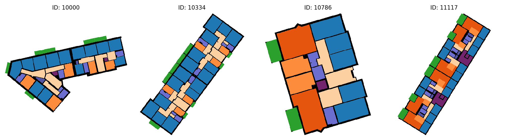
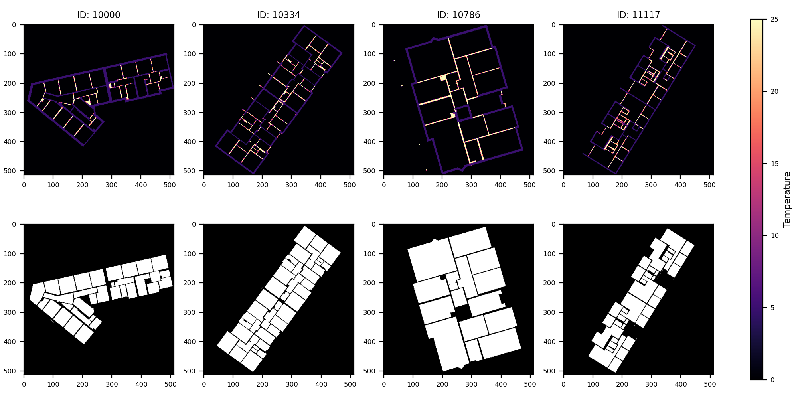
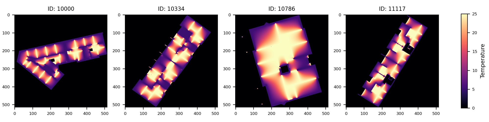

# 02613 Mini-Project: Wall Heating!

## Background

In this project, we will evaluate a fictional experimental building heating solution: *Wall Heating!* Instead of radiators and/or floor heating, we will install heating elements in the inside walls of a building such that *the entire wall* can act as a radiator. To avoid structural issues, we will leave load bearing walls untouched, i.e., they will remain cold.

The goal of the project is evaluate the effectiveness of the Wall Heating approach as quickly as possible. To this end, we will simulate the result of applying it to buildings from the [Modified Swiss Dwellings](https://www.kaggle.com/datasets/caspervanengelenburg/modified-swiss-dwellings) dataset. This dataset contains 4571 building floorplans - see Fig. 1 for examples - with load bearing and inside walls marked. This allows us to evaluate Wall Heating on a large and diverse set of buildings.


***Figure 1:** Example floorplans from the [Modified Swiss Dwellings](https://www.kaggle.com/datasets/caspervanengelenburg/modified-swiss-dwellings) dataset [[1](#references)]. Follow the links for explanation of the coloring scheme (not necessary for the project).*

To simplify our work, we will perform the simulations in 2D. We assume that inside wall are heated such that they always have a temperature of 25ºC and the colder load bearing walls always have a temperature of 5ºC. Given these conditions, we seek the temperature distribution inside the rooms of the building.

Mathematically, we can model this as follows. Let $u$ be a function such that $u(x,y)$ is the temperature at location $(x,y)$. We now seek the *steady-state heat distribution* where the temperature is stable at all locations. This can be found by solving the following partial differential equation (also known as Laplace's equation)

$$\frac{\partial^2 u}{\partial x^2} + \frac{\partial^2 u}{\partial y^2} = 0 \, ,$$

subject to the Dirichlet boundary conditions of $u(x,y) = 5$ when $(x,y)$ is on a load bearing wall and $u(x,y) = 25$ when $(x,y)$ is on an inside wall.

This problem can be solved numerically by discretizing it on an $S \times S$ square grid. We denote the solution at grid point $(i,j)$ as $u_{i,j}$. The solution can then be computed by repeatedly updating all *interior points* (i.e., grid points *inside* a room and *not* on a wall) as the average of its neighbors:

$$u_{i,j} \leftarrow \frac{1}{4}(u_{i,j-1} + u_{i,j+1} + u_{i-1,j} + u_{i+1,j}) \, .$$

Grid points on walls are fixed to their initial values and not updated. Grid points outside the building are also not updated. Note, for simplicity, we ignore the grid spacing. This method is known as the *Jacobi method*. The updates should be repeated until a maximum number of iterations are performed or until the grid no longer changes, in which case the solution has converged.

The floor plan for each building has been converted to 514 x 514 simulation grids and can found at
`/dtu/projects/02613_2025/data/modified_swiss_dwellings/`
Each building is denoted by a numerical ID. For each building, there are two files:

1. `{building_id}_domain.npy`: This file contains a NumPy array with the initial conditions for the simulation grid $u$. Grid points on load bearing walls have been been set to 5 and grid points on inside walls to 25. All other points have been set to 0.
2. `{building_id}_interior.npy`: This file contains a NumPy array with a binary mask. It is 1 for all interior grid points (i.e., grid points inside a room) and 0 for all other grid points (i.e., grid points on walls and outside the building). During the Jacobi iterations, *only* grid points with a 1 should be updated.

Fig. 2 shows examples of the simulation grid input files.


***Figure 2:** Example input grids. **Top row:** Initial conditions for the simulation grid. Interior points are set to 0, inside walls are set to 25ºC and load bearing walls are set to 5ºC. **Bottom row:** Binary masks with interior points marked as white.*

Using the Jacobi method, the solutions to the examples in Fig. 2 are shown in Fig. 3. Notice how the temperature now smoothly changes between the hot inside walls and the cold load bearing walls.


***Figure 3:** Example simulation results for the input grids in Fig. 2. Warmth has diffused out from the hot inside walls.*

Given these solutions, we can now evaluate the viability of the Wall Heating approach. Specifically, we will use the following quantities for each building in the dataset:

1. What is the mean temperature inside the rooms? This gives an overall estimate of the temperature.
2. What is the standard deviation of the temperature inside the rooms? This gives an estimate of how *consistent* the temperature is.
3. What percentage of the area of the rooms is above 18ºC? Areas below 18ºC have increased risk of mold, so this should ideally be high.
4. What percentage of the area of the rooms is below 15ºC? Areas below 15ºC are deemed too cold for human comfort, so this should ideally be low.

As a starting point for your analysis and optimization efforts, please use the below Python script: `simulate.py`. This script will load in the input data for the first `N` buildings, run the temperature simulation using the Jacobi method, compute the quantities listed above and finally print the results in CSV format. Call it as: `python simulate.py <N>`. The only problem: the script is too slow!

Your goal is to optimize this script to run as fast as possible. You may change it however you like to complete the tasks. Compare with the results from this script to verify the correctness of your optimized solutions.

```python
from os.path import join
import sys

import numpy as np


def load_data(load_dir, bid):
    SIZE = 512
    u = np.zeros((SIZE + 2, SIZE + 2))
    u[1:-1, 1:-1] = np.load(join(load_dir, f"{bid}_domain.npy"))
    interior_mask = np.load(join(load_dir, f"{bid}_interior.npy"))
    return u, interior_mask


def jacobi(u, interior_mask, max_iter, atol=1e-6):
    u = np.copy(u)

    for i in range(max_iter):
        # Compute average of left, right, up and down neighbors, see eq. (1)
        u_new = 0.25 * (u[1:-1, :-2] + u[1:-1, 2:] + u[:-2, 1:-1] + u[2:, 1:-1])
        u_new_interior = u_new[interior_mask]
        delta = np.abs(u[1:-1, 1:-1][interior_mask] - u_new_interior).max()
        u[1:-1, 1:-1][interior_mask] = u_new_interior

        if delta < atol:
            break
    return u


def summary_stats(u, interior_mask):
    u_interior = u[1:-1, 1:-1][interior_mask]
    mean_temp = u_interior.mean()
    std_temp = u_interior.std()
    pct_above_18 = np.sum(u_interior > 18) / u_interior.size * 100
    pct_below_15 = np.sum(u_interior < 15) / u_interior.size * 100
    return {
        'mean_temp': mean_temp,
        'std_temp': std_temp,
        'pct_above_18': pct_above_18,
        'pct_below_15': pct_below_15,
    }


if __name__ == '__main__':
    # Load data
    LOAD_DIR = '/dtu/projects/02613_2025/data/modified_swiss_dwellings/'
    with open(join(LOAD_DIR, 'building_ids.txt'), 'r') as f:
        building_ids = f.read().splitlines()

    if len(sys.argv) < 2:
        N = 1
    else:
        N = int(sys.argv[1])
    building_ids = building_ids[:N]

    # Load floor plans
    all_u0 = np.empty((N, 514, 514))
    all_interior_mask = np.empty((N, 512, 512), dtype='bool')
    for i, bid in enumerate(building_ids):
        u0, interior_mask = load_data(LOAD_DIR, bid)
        all_u0[i] = u0
        all_interior_mask[i] = interior_mask

    # Run jacobi iterations for each floor plan
    MAX_ITER = 20_000
    ABS_TOL = 1e-4

    all_u = np.empty_like(all_u0)
    for i, (u0, interior_mask) in enumerate(zip(all_u0, all_interior_mask)):
        u = jacobi(u0, interior_mask, MAX_ITER, ABS_TOL)
        all_u[i] = u

    # Print summary statistics in CSV format
    stat_keys = ['mean_temp', 'std_temp', 'pct_above_18', 'pct_below_15']
    print('building_id, ' + ', '.join(stat_keys))  # CSV header
    for bid, u, interior_mask in zip(building_ids, all_u, all_interior_mask):
        stats = summary_stats(u, interior_mask)
        print(f"{bid},", ", ".join(str(stats[k]) for k in stat_keys))
```
*simulate.py*

## Tasks

1. Familiarize yourself with the data. Load and visualize the input data for a few floorplans using a separate Python script, Jupyter notebook or your preferred tool.
2. Familiarize yourself with the provided script. Run and time the reference implementation for a small subset of floorplans (e.g., 10 - 20). How long do you estimate it would take to process all the floorplans? Perform the timing as a batch job so you get reliable results.
3. Visualize the simulation results for a few floorplans.
4. Profile the reference `jacobi` function using kernprof. Explain the different parts of the function and how much time each part takes.
5. Make a new Python program where you parallelize the computations over the floorplans. Use static scheduling such that each worker is assigned the same amount of floorplans to process. You should use no more than 100 floorplans for your timing experiments. Again, use a batch job to ensure consistent results.
    1. Measure the speed-up as more workers are added. Plot your speed-ups.
    2. Estimate your parallel fraction according to Amdahl's law. How much (roughly) is parallelized?
    3. What is your theoretical maximum speed-up according to Amdahl's law? How much of that did you achieve? How many cores did that take?
    4. How long would you estimate it would take to process all floorplans using your fastest parallel solution?
6. The amount of iterations needed to reach convergence will vary from floorplan to floorplan. Re-do your parallelization experiment using dynamic scheduling.
    1. Did it get faster? By how much?
    2. Did the speed-up improve or worsen?
7. Implement another solution where you rewrite the `jacobi` function using Numba JIT *on the CPU*.
    1. Run and time the new solution for a small subset of floorplans. How does the performance compare to the reference?
    2. Explain your function. How did you ensure your access pattern works well with the CPU cache?
    3. How long would it now take to process all floorplans?
8. Implement another solution writing a custom CUDA kernel with Numba. To synchronize threads between each iteration, the kernel should only perform *a single iteration* of the Jacobi solver. Skip the early stopping criteria and just run for a fixed amount of iterations. Write a helper function which takes the same inputs as the reference implementation (except for the `atol` input which is not needed) and then calls your kernel repeatedly to perform the implementations.
    1. Briefly describe your new solution. How did you structure your kernel and helper function?
    2. Run and time the new solution for a small subset of floorplans. How does the performance compare to the reference?
    3. How long would it now take to process all floorplans?
9. Adapt the reference solution to run on the GPU using CuPy.
    1. Run and time the new solution for a small subset of floorplans. How does the performance compare to the reference?
    2. How long would it now take to process all floorplans?
    3. Was anything surprising about the performance?
10. Profile the CuPy solution using the nsys profiler. What is the main issue regarding performance? (Hint: see exercises from week 10) Try to fix it.
11. **(Optional)** Improve the performance of one or more of your solutions further. For example, parallelize your CPU JIT solution. Or use job arrays to parallelize a solution over multiple jobs. How fast can you get?
12. Process all floorplans using one of your implementations (ideally a fast one) and answer the below questions.
    Hint: use Pandas to process the CSV results generated by the script.
    1. What is the distribution of the mean temperatures? Show your results as histograms.
    2. What is the average mean temperature of the buildings?
    3. What is the average temperature standard deviation?
    4. How many buildings had at least 50% of their area above 18ºC?
    5. How many buildings had at least 50% of their area below 15ºC?

## Hand-in

Compile your answers to the above tasks in a *short* written report that you will hand in as a group on DTU Learn. Your report should be handed in as a PDF file. Additionally, you must also hand in a zip-file with your Python code and job scripts you've written to solve the questions. Where it makes sense, you may also include code snippets directly in the report.

Deadline for hand-in is 3rd of May, 2026, 23:55.
To attend the exam, it is a requirement that the project is handed in and passed. Passing is based on a overall assessment of the entire report.
You will receive written feedback on your report. However, your performance on the project has no effect on your final grade.

## References

1. van Engelenburg et al., *"MSD: A Benchmark Dataset for Floor Plan Generation of Building Complexes"*, European Conference on Computer Vision (ECCV), 2024.
